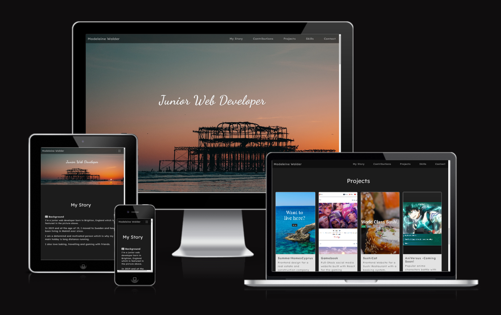

# 18/09/24 This is no longer my current portfolio!
# For my current portfolio please go to: [https://web-creator-maddy.webflow.io/](https://web-creator-maddy.webflow.io/)


---


### This is my personal portfolio website, built by me for me! Click the link below to view. Thanks for visiting!

### Link to Live Site: [https://madeleinewalder.github.io/portfolio/](https://madeleinewalder.github.io/portfolio/)



## Update Log

### 12/08/24
- Major layout change! Rearranged and edited all text content for better readability
- Images of contributions and projects added
- Clickable cards and hover effects

### 10/07/24
- New and improved font for better readability
- Better file structure for images
- Visual improvement: Adjusted each content section to be a size that looks proportional to the amount of content within, rather than all the same size.
- Added the new SummerHomes project to the projects list

### 25/05/24
- Made navbar transparent and permanently fixed to top of page
- Fixed bug where site had a horizontal scroll bar
- Fixed bug where 'Back to Top' button stopped functioning because of navbar position changes

### 22/05/24
- Fixed problem where Contributions section is too close to the section above it on certain desktop screen sizes.
- Added 'Back to Top' button which will be especially helpful for mobile users as they have to scroll further.

## Future Improvements
- Make all text smaller on mobile devices
- Add more images & a profile picture
- Change navbar font colours, should be white and go gray when hovered, not the opposite
- Make a card for each project, include a short description and two buttons, one to go to the live site and one to go to the Github repo
- Add a contact form or remove contact from navbar in the mean time, OR make it more clear that the contact section is the details in the footer


## Local Hosting

- Open a preview or browser with this command: ```python3 -m http.server```
- Stop with CTRL + c in terminal.
